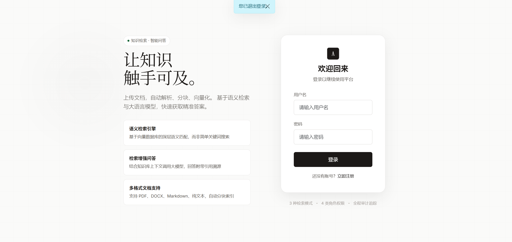
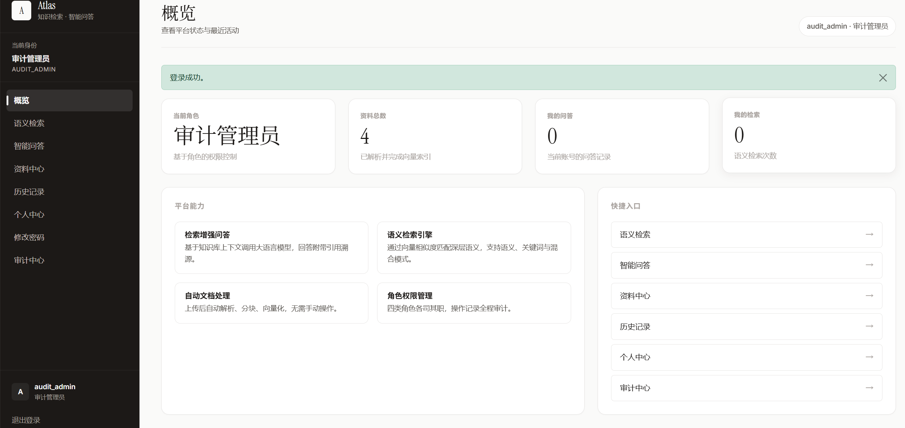
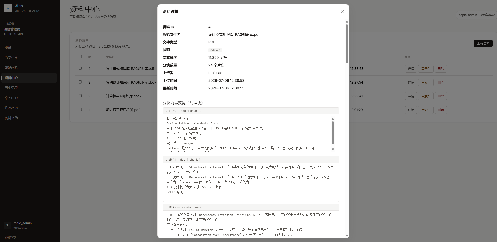
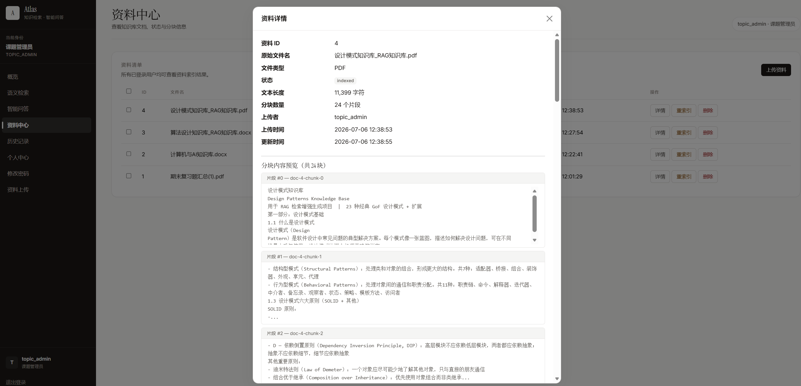
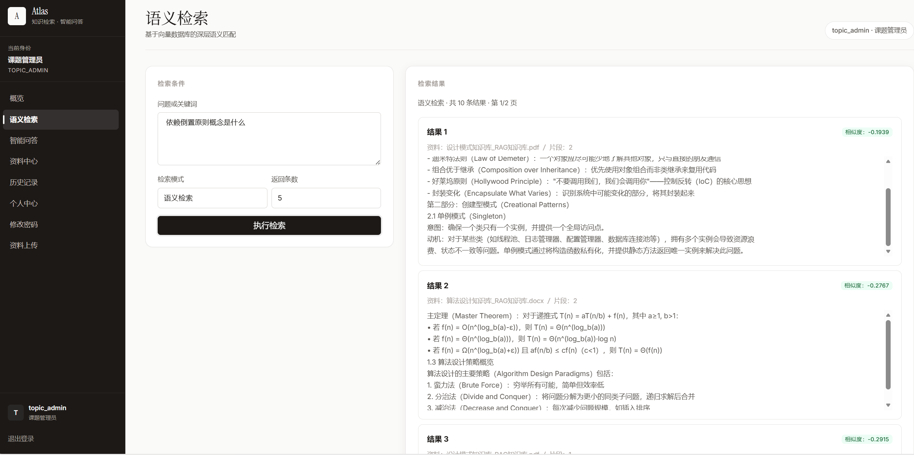
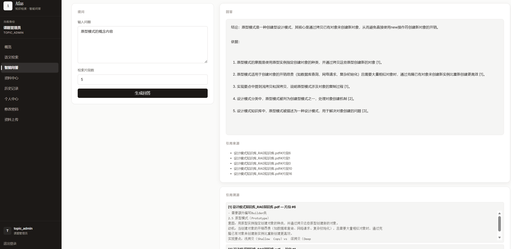
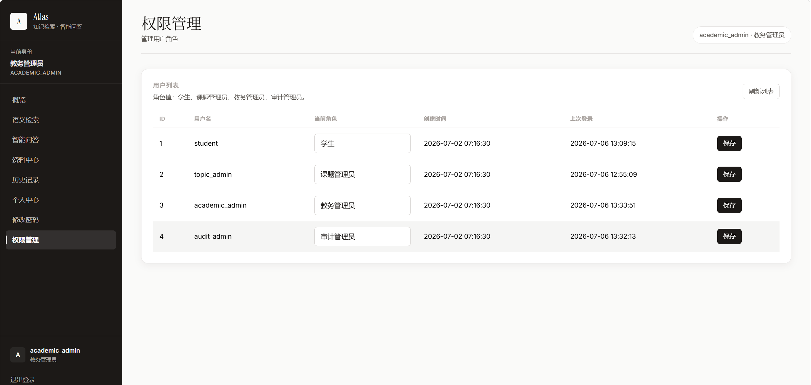
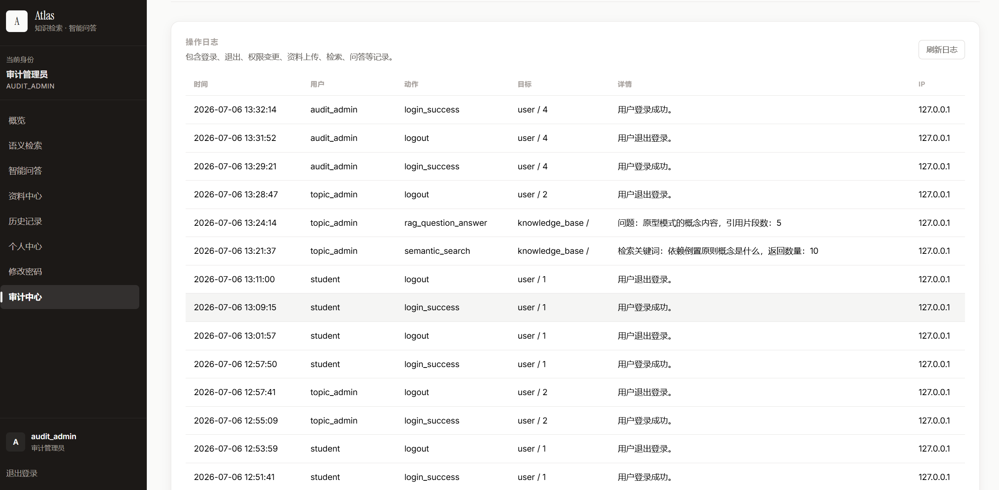

# Atlas — 知识检索与智能问答平台

基于 Flask 的 RAG（检索增强生成）知识库 Web 应用，集成 ChromaDB 向量检索与智谱 AI 大模型，支持文档上传解析、语义检索、智能问答与引用溯源。

---

## 项目展示

### 登录页



登录页采用左右分栏布局：左侧展示平台核心价值主张——"让知识触手可及"，并列出三大特性卡片（语义检索引擎、检索增强问答、多格式文档支持）；右侧为登录表单，顶部带有 Atlas 品牌标识。页面使用 GSAP 驱动特性卡片轻柔浮动、品牌标识呼吸动画，背景装饰元素缓慢漂移，营造"活页面"的呼吸感而非炫技动画。

---

### 仪表盘 / 首页



登录后进入仪表盘，顶部显示当前角色信息与欢迎语。内容区包含三张统计卡片（我的检索、资料总数、我的问答），直观反映平台状态；下方提供快捷入口卡片，根据当前角色动态显示可访问的功能页面。审计管理员视角下，侧边栏会额外显示"审计中心"入口。

---

### 资料中心 — 文档列表



资料中心以表格形式展示知识库中所有文档，包含 ID、文件名、状态（indexed/uploaded）、分块数、上传人、上传时间等信息。课题管理员（topic_admin）可执行详情查看、重建索引、删除操作，并可通过顶部"上传资料"按钮跳转上传页。所有已登录用户均可查看资料清单。

---

### 资料中心 — 文档详情与分块预览



点击文档的"详情"按钮，展开该文档的详细信息与分块内容预览。可以看到文档的原始文件名、文件类型、文本长度、分块总数（如 24 块），以及每个分块的编号与实际文本内容。分块以段落感知方式切分，确保语义完整性，为后续向量检索提供高质量输入。

---

### 语义检索



语义检索页支持三种检索模式：语义检索（基于向量相似度）、关键词检索（精确匹配）、混合检索（两者结合）。用户输入查询语句后，系统将问题向量化并在 ChromaDB 中检索最相关的文档片段，结果按相似度评分排序并高亮匹配内容。支持设置返回条数（top_k）和分页浏览。

如图所示，搜索"依赖倒置原则概念是什么"，系统返回了设计模式知识库和算法设计知识库中的相关片段，每条结果标注来源文档、片段编号和相似度评分（如 0.2915）。

---

### 智能问答（RAG）



智能问答页是系统的核心功能。用户输入问题后，系统执行完整的 RAG 流程：
1. **语义检索**：在向量库中检索最相关的文档片段
2. **上下文构造**：将检索结果带编号标记组装为上下文
3. **大模型生成**：调用智谱 GLM-4-Flash 模型生成回答
4. **引用溯源**：回答附带引用来源列表，可展开查看原始片段全文

如图所示，用户提问"原型模式的概念"，系统返回了结构化的回答（包含定义、意图、适用场景、实现要点等），并附带了 5 个引用来源，每个引用标注了来源文档和片段编号。

---

### 权限管理



权限管理页（仅教务管理员 academic_admin 可访问）以表格展示所有用户信息，包含用户名、当前角色、创建时间、上次登录时间。教务管理员可在此修改用户角色（学生/课题管理员/教务管理员/审计管理员），实现细粒度的权限控制。

---

### 审计日志



审计日志页（仅审计管理员 audit_admin 可访问）记录系统所有关键操作，包含登录/退出、文档上传/删除、检索、问答等。每条日志记录时间、操作用户、动作类型、目标对象、详情描述和 IP 地址，支持追溯所有用户行为。

---

## 技术栈

| 类别 | 技术 |
|------|------|
| Web 框架 | Flask 3.x |
| 数据库 | SQLite + SQLAlchemy |
| 向量数据库 | ChromaDB 1.5.x |
| Embedding | 智谱 AI Embedding API（embedding-3） |
| 大语言模型 | 智谱 AI GLM-4-Flash |
| 前端 | Bootstrap 5.3 + 原生 JavaScript + marked.js |
| 文档解析 | PyPDF2, python-docx |
| 动画 | GSAP 3.12（登录页持续循环动画） |

## 功能特性

### 核心功能
- **语义检索**：基于向量相似度的知识库搜索，支持语义/关键词/混合三种模式
- **RAG 智能问答**：检索知识库 + 大模型生成，答案带引用溯源
- **文档管理**：上传、查看、重建索引、删除（含级联清理向量与文件）
- **用户注册**：自助注册，默认获得学生权限
- **密码修改**：登录后修改密码

### 权限体系

| 角色 | 用户名 | 权限 |
|------|--------|------|
| 学生 | student | 检索、问答、历史、注册 |
| 课题管理员 | topic_admin | + 文档上传、删除、重索引 |
| 教务管理员 | academic_admin | + 用户角色管理 |
| 审计管理员 | audit_admin | + 审计日志查看 |

### 其他
- 文档详情 Modal 展示（分块内容预览）
- 批量文档删除
- 搜索分页与结果高亮
- 答案 Markdown 渲染
- Toast 通知系统
- 历史记录 CSV 导出
- 系统健康检查 API

## 项目结构

```text
计算三_mj/
├── app.py                          # 启动入口
├── config.py                       # 配置类（BaseConfig / DevelopmentConfig）
├── .env                            # 环境变量（需自行创建）
├── .env.example                    # 环境变量模板
├── requirements.txt
├── docs/
│   └── screenshots/                # 项目截图
├── instance/
│   └── app.db                      # SQLite 数据库
├── app/
│   ├── __init__.py                 # 应用工厂 + 启动校验
│   ├── models.py                   # User / Document / DocumentChunk / QueryHistory / SearchHistory / AuditLog
│   ├── decorators.py               # @login_required / @role_required
│   ├── routes/
│   │   ├── auth.py                 # /login, /logout, /register, /change-password
│   │   ├── main.py                 # 页面路由 + API（CRUD、检索、问答、历史、导出、健康检查）
│   │   └── admin.py                # 用户管理 + 审计日志 API
│   ├── services/
│   │   ├── document_service.py     # 上传、解析、索引、删除、重索引、批量删除
│   │   ├── vector_service.py       # ChromaDB 封装
│   │   ├── zhipu_embedding.py      # 智谱 AI Embedding（ChromaDB EmbeddingFunction）
│   │   ├── rag_service.py          # 语义检索、关键词检索、混合检索、RAG 问答
│   │   └── audit_service.py        # 审计日志写入
│   ├── utils/
│   │   ├── file_parser.py          # txt / md / pdf / docx 解析
│   │   └── text_chunker.py         # 段落感知的文本分块
│   ├── templates/                  # Jinja2 模板（12 个页面）
│   ├── static/
│   │   ├── css/custom.css          # 商业级设计系统
│   │   └── js/main.js              # 前端交互逻辑
│   ├── uploads/                    # raw / parsed
│   └── data/chroma_db/             # ChromaDB 持久化
```

## 快速启动

### 1. 创建虚拟环境

```bash
python -m venv .venv
.venv\Scripts\activate  # Windows
```

### 2. 安装依赖

```bash
pip install -r requirements.txt
```

### 3. 配置环境变量

```bash
copy .env.example .env
# 编辑 .env，填入智谱 AI API Key
```

### 4. 启动

```bash
python app.py
```

访问 `http://127.0.0.1:5000`

## 默认账号

| 用户名 | 密码 | 角色 |
|--------|------|------|
| student | Stu@123 | 学生 |
| topic_admin | TopicAdmin@123 | 课题管理员 |
| academic_admin | AcadAdmin@123 | 教务管理员 |
| audit_admin | Audit@123 | 审计管理员 |

## API 速览

| 端点 | 方法 | 权限 | 说明 |
|------|------|------|------|
| `/api/documents` | GET | 登录 | 文档列表 |
| `/api/documents/<id>` | GET | 登录 | 文档详情 + 分块 |
| `/api/documents/<id>` | DELETE | topic_admin | 删除文档 |
| `/api/documents/<id>/reindex` | POST | topic_admin | 重建索引 |
| `/api/documents/batch-delete` | POST | topic_admin | 批量删除 |
| `/api/documents/upload` | POST | topic_admin | 上传文档 |
| `/api/search` | POST | 登录 | 检索（semantic/keyword/hybrid） |
| `/api/search/suggestions` | GET | 登录 | 搜索建议 |
| `/api/qa` | POST | 登录 | RAG 问答 |
| `/api/history` | GET | 登录 | 问答/检索历史 |
| `/api/history/export` | GET | 登录 | 导出 CSV |
| `/api/health` | GET | 登录 | 系统健康检查 |

## 清空数据

```bash
# Windows PowerShell
Remove-Item instance\app.db
Remove-Item -Recurse -Force app\data\chroma_db
Remove-Item -Recurse -Force app\uploads\raw\*
Remove-Item -Recurse -Force app\uploads\parsed\*
```
